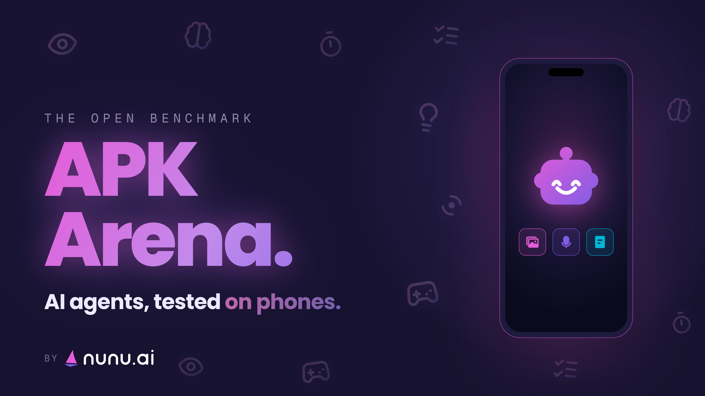
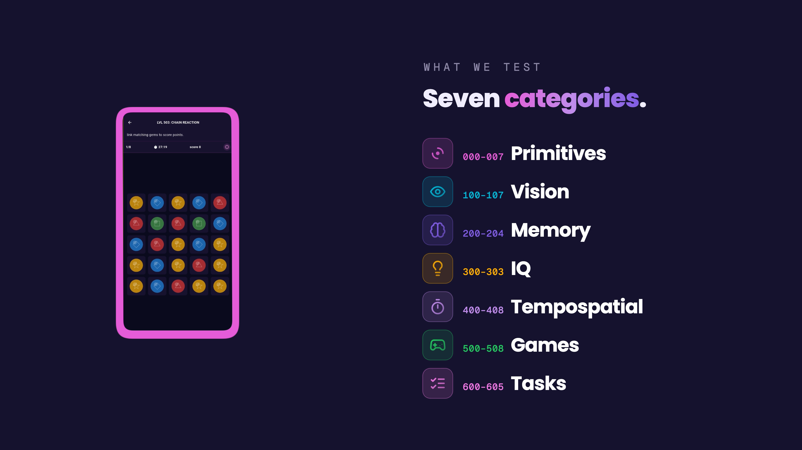

APK arena is an open benchmark for **vision-based phone use AI agents** — a native Android/iOS app you can set up in 30 seconds and run against any agent harness.

Check out the results we achieve with our harness or get the app and run the benchmark yourself!

  

  

  

---

## 📖 Overview

While existing benchmarks like [Android World](https://github.com/google-research/android_world) provide comprehensive testing environments, they come with an annoying and complex setup and on top of that they are slowly saturated. So, inspired by the [WebGames](https://webgames.convergence.ai/) we developed our own, fast to setup and easy to use benchmark.

Most levels came out of a real problem we hit building our harness and agents in production at nunu.ai, e.g. gestures that kept failing, a game our agents played badly, a task we could not complete reliably.

Each level is an isolated game, task or challenge that gets automatically scored between 0 and 1 based on the key metrics we are interested in. For games it can be score, for tasks it can be mistakes or time, for interactions it is accuracy, etc.

We feature 50+ levels across 7 categories:

| Category | What it tests |
|---|---|
| 👆 **Primitives** | Basic touchscreen control and fine motor accuracy — tapping, swiping, complex gestures |
| 👁️ **Vision** | Reading the screen: counting, matching, visual search |
| 🧠 **Memory** | Detecting important information and recalling it across long tasks |
| 🧩 **IQ** | Reasoning and rule induction, mostly puzzles |
| ⏱️ **Tempospatial** | Temporal and spatial reasoning |
| 🎮 **Games** | Multi-step games requiring strategy |
| ✅ **Tasks** | Real workflows: using phone UI, following multi-step instructions |

---

## 📚 Guides

- **[Running the benchmark](docs/RUNNING.md)** — installing the app, driving it from your harness via deeplinks, and pulling the results artifact
- **[Contributing levels](docs/DEVELOPMENT.md)** — project structure, theming, level design, and step-by-step tutorial for adding new levels

---

Made with ❤️ by the nunu.ai team - for better mobile agents
